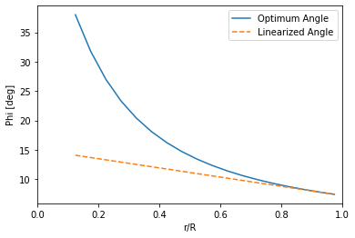

# Wind-Turbine-Blade-Design_BEM-Method

# Introduction

This project designs a wind turbine blade using the Blade Element Method (BEM) using the operating conditions of a Vestas V90-2MW turbine in the wind class IEC IIA. 

The overall blade shape was determined from the optimal values of chord and angle but was linearized because of fabrication limitations. The linearized was done using the last two elements and evaluating a linear line across the other elements.The optimal and linearized values of the angle and chord are shown below.

