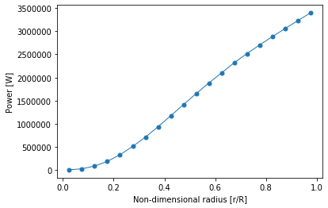

# Wind-Turbine-Blade-Design_BEM-Method

# Introduction

This project designs a wind turbine blade using the Blade Element Method (BEM) using the operating conditions of a Vestas V90-2MW turbine in the wind class IEC IIA. 

The overall blade shape was determined from the optimal values of chord and angle but was linearized because of fabrication limitations. The linearized was done using the last two elements and evaluating a linear line across the other elements.The optimal and linearized values of the angle and chord are shown below.

The power distribution that the blade produces is shown below.

The part of the blade that produces the most power without tip losses is the tip of the blade. The last half of the blade contributes 80% of the overall power captured. 

The final blade design results in the following performance parameters:

|Condition|Coefficent of Performance (Cp)|
|---------|------|
| Rated |0.499 |
| No Drag |0.520|
|No Drag and with tip loss| 0.442|

|Power Output|[MW]|
|---------|------|
|Blade Power with no drag| 2.492|
|Blade Power with drag| 2.392 |
|Blade Power with drag and tip losses |2.121|
